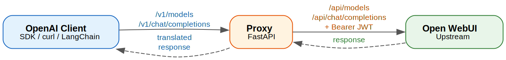

<h1 align="center">
OpenAI-Compatible Proxy for Open WebUI 🔌
</h1>

<p align="center">
A lightweight <strong>FastAPI</strong> proxy that exposes <code>/v1/models</code> and <code>/v1/chat/completions</code> endpoints, forwarding requests to Open WebUI's internal API with JWT authentication. Use any OpenAI-compatible client — whether it's an SDK, curl, or a third-party app — with an Open WebUI backend.
</p>

## Why Use This? 🤔

Open WebUI provides its own `/v1/*` endpoints, but they require a **generated API key** (`sk-...`). This proxy takes a different approach — it authenticates using the **JWT token from a user's browser session**, which means:

- **🔑 Per-user access without admin setup** — Any user who can log into Open WebUI can use this proxy. No need to ask an admin to enable API keys, create key groups, or grant API permissions.

- **🧩 Drop-in OpenAI SDK compatibility** — Point any OpenAI-compatible tool (LangChain, LiteLLM, Cursor, Continue.dev, etc.) at `http://localhost:8000` and it just works. The proxy translates between OpenAI's expected API format and Open WebUI's internal endpoints.

- **🛡️ User-scoped model access** — The JWT carries the user's identity and permissions. Each user sees only the models they have access to in Open WebUI, with the same rate limits and policies that apply in the web interface.

- **🏢 Works behind institutional deployments** — Many organizations (like universities) run Open WebUI instances where API key generation is disabled or restricted. This proxy sidesteps that limitation entirely by using the same auth mechanism as the web UI itself.

## Architecture 🏗️

<div align="center">
  
</div>

Clients speak OpenAI's API format. The proxy translates those requests to Open WebUI's internal endpoints and handles JWT authentication transparently.

## How to Install ⚡

### Prerequisites 📦

- **Python 3.12+**: Make sure you have Python installed. You can download it from the [official Python website](https://www.python.org/downloads/).

- **An Open WebUI instance**: Running somewhere reachable from this machine.

- **A valid JWT token**: Obtained by logging into your Open WebUI account.

### Environment Variables 🔧

| Variable | Required | Default | Description |
|----------|----------|---------|-------------|
| `OPEN_WEBUI_URL` | Yes | — | Base URL of your Open WebUI instance |
| `USER_TOKEN` | Yes | — | JWT token obtained from logging into Open WebUI |
| `PORT` | No | `8000` | Port the proxy server listens on |

1. **Configure the `.env` file**: Run the following:

```sh
cp .env.example .env
```

From there, edit the file and set the values appropriately. Use `<your-jwt-from-login>` as a placeholder until you have the real token. Never commit `.env` with actual credentials.

```plaintext
OPEN_WEBUI_URL=https://your-open-webui-instance.example.com
USER_TOKEN=<your-jwt-from-login>
PORT=8000
```

### Quick Start (Local) 💻

2. **Install dependencies and run**:

```sh
pip install .
uvicorn src.main:app --port 8000
```

The server starts on port 8000 by default. It will load credentials from `.env` automatically.

### Docker Compose 🐳

Alternatively, run with Docker:

```sh
cp .env.example .env
# Edit .env with your OPEN_WEBUI_URL and USER_TOKEN
docker compose up -d
```

This builds the image from the provided Dockerfile and runs the proxy in detached mode. Port mapping honors the `PORT` variable from `.env`.

## API Endpoints 🌐

| Endpoint | Method | Description |
|----------|--------|-------------|
| `/health` | GET | Health check |
| `/v1/models` | GET | List available models (OpenAI-compatible) |
| `/v1/chat/completions` | POST | Chat completions (supports streaming) |

### Curl Examples 📡

```bash
# Health check
curl http://localhost:8000/health

# List models
curl http://localhost:8000/v1/models

# Chat completion
curl -X POST http://localhost:8000/v1/chat/completions \
  -H "Content-Type: application/json" \
  -d '{"model":"llama3","messages":[{"role":"user","content":"Hello!"}]}'

# Streaming chat
curl -X POST http://localhost:8000/v1/chat/completions \
  -H "Content-Type: application/json" \
  -d '{"model":"llama3","messages":[{"role":"user","content":"Hello!"}],"stream":true}'
```

Replace `llama3` with a model name that exists in your Open WebUI instance. The streaming endpoint returns Server-Sent Events (`text/event-stream`).

## Testing 🧪

### Unit Tests

Unit tests run against mocked upstream responses — no real Open WebUI instance needed:

```sh
pip install ".[dev]"
python -m pytest tests/test_translator.py tests/test_app.py -v
```

### Integration Tests

Integration tests hit a real Open WebUI instance through the proxy. They are **skipped automatically** unless you provide real credentials:

```sh
OPEN_WEBUI_URL=https://your-open-webui-instance.example.com USER_TOKEN=<your-real-jwt> \
  python -m pytest tests/integration/ -v
```

These tests verify:
- `/health` returns 200
- `/v1/models` returns a valid OpenAI-compatible model list with no leaked upstream fields
- `/v1/chat/completions` returns a well-formed chat completion (non-streaming)
- `/v1/chat/completions` with `stream: true` returns SSE chunks

### All Tests

```sh
# Unit only (no credentials needed)
python -m pytest tests/test_translator.py tests/test_app.py -v

# Full suite (integration tests skip without real credentials)
python -m pytest -v -rs
```

## Known Limitations ⚠️

- **JWT token expiry** — Tokens from Open WebUI may expire after a period of time. You'll need to log in again and update `.env` manually.
- **No automatic token refresh** — The proxy has no mechanism to renew expired tokens.
- **No individual model lookup** — Only `/v1/models` (list all) is supported. There is no `/v1/models/{id}` endpoint.
- **No embeddings, audio, or image endpoints** — The proxy only covers `/v1/models` and `/v1/chat/completions`. All other OpenAI API endpoints are unavailable.

## License 📜

This project is licensed under the MIT License - see the [LICENSE](LICENSE) file for details.
