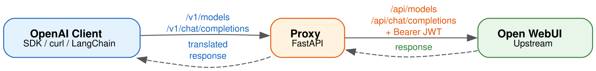

<h1 align="center">
OpenAI-Compatible Proxy for Open WebUI 🔌
</h1>

<p align="center">
A lightweight <strong>FastAPI</strong> proxy that exposes <code>/v1/models</code> and <code>/v1/chat/completions</code> endpoints, forwarding requests to Open WebUI's internal API with JWT authentication. Use any OpenAI-compatible client — whether it's an SDK, curl, or a third-party app — with an Open WebUI backend.
</p>

## Why Use This? 🤔

Open WebUI provides its own `/v1/*` endpoints, but they require a **generated API key** (`sk-...`). This proxy takes a different approach — it authenticates using the **JWT token from a user's browser session**, which means:

- **🔑 Per-user access without admin setup** — Any user who can log into Open WebUI can use this proxy. No need to ask an admin to enable API keys, create key groups, or grant API permissions.

- **🧩 Drop-in OpenAI SDK compatibility** — Point any OpenAI-compatible tool (LangChain, LiteLLM, Cursor, Continue.dev, etc.) at `http://localhost:8000` and it just works. The proxy translates between OpenAI's expected API format and Open WebUI's internal endpoints.

- **🛡️ User-scoped model access** — The JWT carries the user's identity and permissions. Each user sees only the models they have access to in Open WebUI, with the same rate limits and policies that apply in the web interface.

- **🏢 Works behind institutional deployments** — Many organizations (like universities) run Open WebUI instances where API key generation is disabled or restricted. This proxy sidesteps that limitation entirely by using the same auth mechanism as the web UI itself.

## Architecture 🏗️

<div align="center">
  
</div>

Clients speak OpenAI's API format. The proxy translates those requests to Open WebUI's internal endpoints and handles JWT authentication transparently.

## How to Install ⚡

### Prerequisites 📦

- **Python 3.12+**: Make sure you have Python installed. You can download it from the [official Python website](https://www.python.org/downloads/).

- **An Open WebUI instance**: Running somewhere reachable from this machine.

- **A valid JWT token**: Obtained by logging into your Open WebUI account.

### Environment Variables 🔧

| Variable | Required | Default | Description |
|----------|----------|---------|-------------|
| `OPEN_WEBUI_URL` | Yes | — | Base URL of your Open WebUI instance |
| `USER_TOKEN` | No | — | JWT from Open WebUI. Used as a fallback when no token file exists; optional if automatic renewal is configured |
| `UA_NETID` | No | — | NetID for automatic browser login (renewal only) |
| `UA_NETID_PASSWORD` | No | — | NetID password for automatic browser login (renewal only) |
| `TOKEN_FILE` | No | `~/.config/open-webui-proxy/token.json` | Path to the renewed-token file, preferred over `USER_TOKEN` |
| `PORT` | No | `8000` | Port the proxy server listens on |
| `REQUEST_TIMEOUT` | No | `300` | Upstream request timeout in seconds (10–3600) |
| `STREAM_EMPTY_RETRY_MAX` | No | `3` | Max retries for empty upstream streams (0–10) |
| `LOG_LEVEL` | No | `INFO` | Logging level (`DEBUG`, `INFO`, `WARNING`, `ERROR`, `CRITICAL`) |

1. **Configure the `.env` file**: Run the following:

```sh
cp .env.example .env
```

From there, edit the file and set the values appropriately. Use `<your-jwt-from-login>` as a placeholder until you have the real token. Never commit `.env` with actual credentials.

```plaintext
OPEN_WEBUI_URL=https://your-open-webui-instance.example.com
USER_TOKEN=<your-jwt-from-login>
PORT=8000
LOG_LEVEL=INFO
```

### Quick Start (Local) 💻

2. **Install dependencies and run**:

```sh
pip install .
uvicorn src.main:app --port 8000
```

The server starts on port 8000 by default. It will load credentials from `.env` automatically.

### Docker Compose 🐳

Alternatively, run with Docker:

```sh
cp .env.example .env
# Edit .env with your OPEN_WEBUI_URL and USER_TOKEN
docker compose up -d
```

This builds the image from the provided Dockerfile and runs the proxy in detached mode. Port mapping honors the `PORT` variable from `.env`.

## API Endpoints 🌐

| Endpoint | Method | Description |
|----------|--------|-------------|
| `/health` | GET | Health check |
| `/v1/models` | GET | List available models (OpenAI-compatible) |
| `/v1/chat/completions` | POST | Chat completions (supports streaming) |
| `/v1/messages` | POST | Anthropic Messages API (supports streaming) |

### Curl Examples 📡

```bash
# Health check
curl http://localhost:8000/health

# List models
curl http://localhost:8000/v1/models

# Chat completion
curl -X POST http://localhost:8000/v1/chat/completions \
  -H "Content-Type: application/json" \
  -d '{"model":"llama3","messages":[{"role":"user","content":"Hello!"}]}'

# Streaming chat
curl -X POST http://localhost:8000/v1/chat/completions \
  -H "Content-Type: application/json" \
  -d '{"model":"llama3","messages":[{"role":"user","content":"Hello!"}],"stream":true}'
```

Replace `llama3` with a model name that exists in your Open WebUI instance. The streaming endpoint returns Server-Sent Events (`text/event-stream`).

### Claude Thinking Variant 🧠

For capable Claude models, the proxy auto-generates one virtual thinking variant in the `/v1/models` list, so you can turn on thinking without hand-injecting a `thinking` parameter:

| Suffix | Effect | Example |
|--------|--------|---------|
| `:adaptive` | `thinking.type=adaptive` (model decides when and how deeply to think) | `claude-sonnet-4-6:adaptive` |

Use the variant name as your `model` value — the proxy strips the suffix and injects the right parameters before forwarding upstream.

```bash
# Chat with adaptive thinking
curl -X POST http://localhost:8000/v1/chat/completions \
  -H "Content-Type: application/json" \
  -d '{"model":"claude-sonnet-4-6:adaptive","messages":[{"role":"user","content":"Explain the Riemann hypothesis"}],"stream":true}'
```

**Notes:**
- `:adaptive` requires Opus/Sonnet 4.6 or newer (or a `fable`/`mythos` model). Claude 4.5 and earlier — including Haiku — reject adaptive upstream, so no variant is offered for them and they get no thinking suffix at all.
- The proxy raises `max_tokens` to 64k when injecting thinking, since the gateway rejects a limit too small to hold a thinking block.
- **A `:extended` suffix is no longer recognised.** It was removed; sending `model:extended` now reaches upstream verbatim and returns `400 Model not found`. Use `:adaptive`, or send `thinking` yourself.
- Thinking content that the model returns on its own is still translated back to clients — this only removes the proxy-generated request variant.
- The `thinking` parameter is Anthropic-only. If you send it for a non-Anthropic model (e.g. a GPT model), the proxy strips it and logs a warning — without this, the provider rejects the request with `400 unknown_parameter: 'thinking'`.
- To control reasoning depth on OpenAI reasoning models, send the standard `reasoning_effort` string (`low`/`medium`/`high`, plus `xhigh` and `none` on newer models). The proxy passes it through untouched, and Open WebUI supports it natively. Note that valid values are model-dependent — `minimal` is rejected by GPT-5.5 and GPT-5.6, and non-reasoning models such as `gpt-4o` reject the parameter entirely.

## Testing 🧪

### Unit Tests

Unit tests run against mocked upstream responses — no real Open WebUI instance needed:

```sh
pip install ".[dev]"
python -m pytest tests/test_openai_translator.py tests/test_openai_routes.py tests/test_anthropic_translator.py tests/test_anthropic_routes.py -v
```

### Integration Tests

Integration tests hit a real Open WebUI instance through the proxy. They are **skipped automatically** unless you provide real credentials:

```sh
OPEN_WEBUI_URL=https://your-open-webui-instance.example.com USER_TOKEN=<your-real-jwt> \
  python -m pytest tests/integration/ -v
```

These tests verify:
- `/health` returns 200
- `/v1/models` returns a valid OpenAI-compatible model list with no leaked upstream fields
- `/v1/chat/completions` returns a well-formed chat completion (non-streaming)
- `/v1/chat/completions` with `stream: true` returns SSE chunks

### All Tests

```sh
# Unit only (no credentials needed)
python -m pytest tests/test_openai_translator.py tests/test_openai_routes.py tests/test_anthropic_translator.py tests/test_anthropic_routes.py -v

# Full suite (integration tests skip without real credentials)
python -m pytest -v -rs
```

## TUI Chat Client 💬

A terminal-based chat interface built with [Textual](https://textual.textualize.io/). It connects to the proxy (not Open WebUI directly), so the proxy must be running first.

```sh
python tui.py
```

Set `PROXY_URL` in `.env` or as an environment variable to point at a non-default proxy address (default: `http://localhost:8000`).

**Features:** model selection dropdown, streaming responses with live Markdown rendering, collapsible thinking blocks for Claude thinking variants, and chat history within the session.

| Binding | Action |
|---------|--------|
| `Enter` | Send message |
| `Shift+Enter` | Insert newline |
| `Ctrl+N` | New chat (clear history) |
| `Ctrl+Q` | Quit |

## Request Handling 🔧

The proxy doesn't just forward requests — it applies several transformations to maximize compatibility with upstream providers (particularly AWS Bedrock via LiteLLM):

- **Bedrock tool-field scrubbing** — Removes empty `tools` arrays, coerces unsupported `tool_choice` values (`"any"`, `"required"`, `"none"`) to Bedrock-compatible equivalents, strips legacy `functions`/`function_call` fields, and injects a placeholder tool when conversation history references tool calls but no tools are declared.
- **Stream usage injection** — Automatically sets `stream_options.include_usage=true` on streaming requests so token usage data is returned in the SSE stream.
- **Empty-stream retry** — If the upstream returns an empty stream, the proxy retries with exponential backoff (configurable via `STREAM_EMPTY_RETRY_MAX`). Client errors (4xx) are never retried.
- **Finish-reason guard** — If the upstream stream ends without sending a `finish_reason`, the proxy synthesizes one to prevent clients from hanging.

All other request fields are passed through to upstream unchanged.

## Known Limitations ⚠️

- **Renewal depends on a persisted browser session** — Automatic renewal reuses the Shibboleth SSO session stored in the sidecar's browser profile, so it normally needs no interaction. If that session and the Duo "trusted browser" cookie both lapse, the next renewal requires approving a Duo Push on your phone. Deleting the browser profile forces a full interactive login.
- **No individual model lookup** — Only `/v1/models` (list all) is supported. There is no `/v1/models/{id}` endpoint.
- **No embeddings, audio, or image endpoints** — The proxy only covers `/v1/models` and `/v1/chat/completions`. All other OpenAI API endpoints are unavailable.

## License 📜

This project is licensed under the MIT License - see the [LICENSE](LICENSE) file for details.
